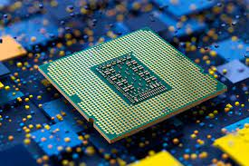
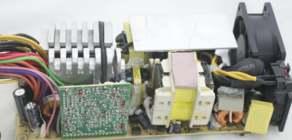

# OS-EX-1-ASSEMBLING-THE-SYSTEM---CASE-STUDY

## AIM:
To assemble the system.
## MATERIALS REQUIRED:
1. Computer case.
2. CPU.
3. RAM.
4. Thermal kit.
5. MotherBoard.
## PROCEDURE:
### 1. PREPARE YOUR WORKSPACE:
Choose a clean, well-lit, and static-free area to work in.

Place the motherboard on a non-conductive
surface like its anti-static bag.
### 2. INSTALL THE CPU (CENTRAL PROCESSING UNIT):
 Open the CPU socket on the motherboard.

 Align the CPU with the socket, ensuring the
notches match.

 Gently place the CPU into the socket without
applying any force.

 Close the socket lever to secure the CPU.

 

### 3. INSTALL THE CPU COOLER:
Apply thermal paste to the CPU
(if not pre-applied on the cooler).

Attach the CPU cooler according to the
manufacturer's instructions.

Connect the cooler's fan to the CPU
fan header on the motherboard.

### 4. INSTALL RAM (RANDOM ACCESS MEMORY):
Open the RAM slots on
the motherboard.

Align the notch on the RAM stick
with the slot on the motherboard.

Press down evenly on both ends of
the RAM stick until it clicks into place.

### 5. INSTALL THE GPU (GRAPHICS PROCESSING UNIT):
If your CPU has integrated graphics, this
step may be unnecessary.

Align the GPU with the PCIe slot
on the motherboard.

Push down gently until it clicks into
place.

Secure the GPU with screws to the case (if
required).

### 6. INSTALL STORAGE DRIVES:
Mount SSDs or HDDs in drive bays or
brackets.

inside the case.

Connect the SATA or NVMe data cables to
the motherboard.

Connect the power cables to the drives and
power supply.

### 7. CONNECT CABLES:
Connect all necessary cables: power cables,
data cables, and front-panel connectors.
Refer to your motherboard and case manuals
for guidance.

### 8. INSTALL THE POWER SUPPLY:
Secure the power supply in the case.

Connect power cables to the motherboard,
CPU, GPU, and drives.

Ensure proper cable management to maintain
good airflow.

### 9. DOUBLE-CHECK CONNECTIONS:
Ensure all connections are secure and properly seated.
### 10. CLOSE THE CASE:
Carefully close and secure the computer case using screws.

## RESULT:
 The computer system has been installed successfully.